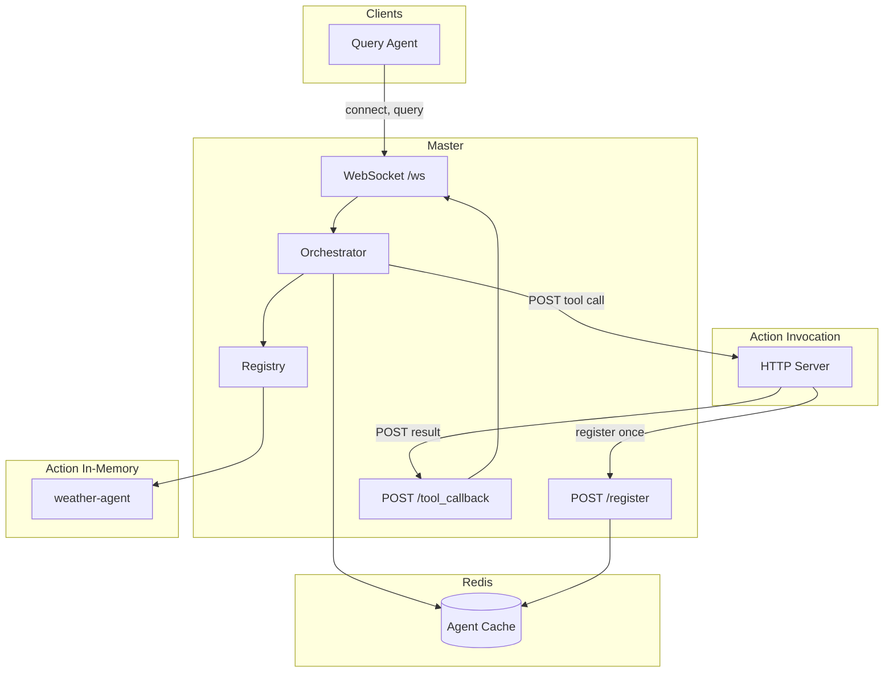

# OpenAgent

Central **master** coordinates **query agents** (send questions) and **action agents** (expose tools). The master uses **GPT-4o-mini** to decide whether to answer directly or call a tool. Action agents can be **in-memory** (WebSocket, live only while connected) or **invocation** (HTTP URL stored in Redis, survive master restart).

## Architecture



- **Query agent**: Connects via WebSocket, sends queries, receives `query_result`.
- **In-memory action agent**: Connects via WebSocket, registers tools, receives `tool_call` over WS. Not stored in Redis; gone when master or agent restarts.
- **Invocation action agent**: Runs an HTTP server. Registers once via `POST /register` (or WS with `invocation_url`). Master stores `invocation_base_url` + per-tool `endpoint` in Redis. On tool call, master POSTs to `{base}{endpoint}`; agent POSTs result to master `/tool_callback`. Survives master restart; master health-checks `GET {base}/health` on startup and `/refresh`.

## Setup

```bash
source ~/base/bin/activate   # or your venv
pip install -r requirements.txt
```

Copy `.env.example` to `.env` and set:

```bash
OPENAI_API_KEY=sk-...
REDIS_URL=redis://localhost:6379
MASTER_BASE_URL=http://127.0.0.1:8000
```

Optional for invocation agent: `INVOCATION_BASE_URL`, `INVOCATION_PORT`, `MASTER_WS`.

## Run

**Terminal 1 – Redis** (required for invocation agents and for master to list known agents)

```bash
redis-server
```

**Terminal 2 – Master** (WebSocket on 8000, HTTP APIs)

```bash
uvicorn master.app:app --reload --reload-dir master --reload-dir protocol --reload-dir openagent --host 0.0.0.0 --port 8000
```

Only `master/`, `protocol/`, and `openagent/` are watched; edits in `agents/` do not restart the server.

**Terminal 3 – Action agent (in-memory)**

```bash
python agents/action_weather.py
```

Stays connected via WebSocket; tools are available only while this process and the master are running.

**Terminal 4 – Action agent (invocation)** (optional)

```bash
python agents/demo_invocation_agent.py
```

Starts an HTTP server and registers with the master once. No WebSocket. Master invokes via HTTP; agent survives master restart (re-register or rely on Redis).

**Terminal 5 – Query agent**

```bash
python agents/query_demo.py
```

Sends example queries; the orchestrator calls the weather or echo/get_time tools and returns answers.

## Master HTTP endpoints

| Endpoint | Description |
|----------|-------------|
| `GET /health` | Liveness |
| `GET /agents` | All agents (tracker + Redis cache), with connection type and status |
| `GET /refresh` | Re-fetch Redis cache and run health checks on invocation agents; returns and prints UP/DOWN |
| `POST /register` | Register an action agent by `invocation_base_url` + tools (with optional per-tool `endpoint`). Redis only. |
| `POST /tool_callback` | Used by invocation agents to post tool results back (call_id, success, result/error) |

WebSocket at `/ws`: connect, send `register`, then `query` (query agents) or receive `tool_call` (action agents).

## Invocation agent contract

- **Health**: Expose `GET {invocation_base_url}/health` → 200 and e.g. `{"status":"ok"}`.
- **Tool call**: Master POSTs to `{invocation_base_url}{tool.endpoint}` with body:
  `call_id`, `tool_name`, `arguments`, `callback_url`.
- **Result**: Agent POSTs to `callback_url` with `call_id`, `success`, and either `result` or `error`.

Each tool can have its own `endpoint` (e.g. `/run`, `/get_time`).

## Project layout

| Path | Description |
|------|-------------|
| `protocol/` | Wire protocol (Pydantic: register, query, tool_call, tool_result, ToolSchema with optional `endpoint`) |
| `openagent/` | Client helpers: `AgentClient`, `connect_master`, `run_action_agent`, `register_invocation_agent`, `ToolSchema` |
| `master/` | FastAPI app, WebSocket, Redis cache, orchestrator, registry, tracker |
| `agents/` | Examples: `action_weather.py` (in-memory), `demo_invocation_agent.py` (invocation), `query_demo.py` |

## Message contract (WebSocket)

- **Agent → Master**: `register`, `query`, `tool_result`, `ping`
- **Master → Agent**: `registered`, `query_result`, `tool_call`, `pong`, `error`

See `protocol/messages.py` for full fields. Register may include `invocation_url` (legacy) for action agents; then the master stores them in Redis and invokes via HTTP.

## Clearing Redis

To reset cached (invocation) agents:

```bash
redis-cli FLUSHDB
```

Then restart the master; invocation agents must re-register.
